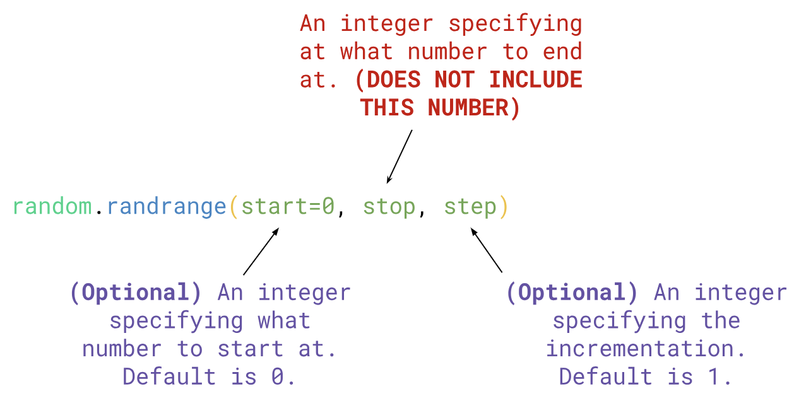

# 4.4 Random Numbers

Sometimes we want to use random generated numbers to create a guessing game or simulate a dice roll.

To generate random numbers in Python, we need to import the `random` library, just like we did with the `math` library:
```python
import random
```

## `random.randrange()`
The most common function we will be using from the `random` library is: `random.randrange()`



<span style="color:red">
<b>NOTE: You must store this in a variable</b>
</span> 

### Examples
```python
random_num = random.randrange(#, #, #)
```

| Range   | Increment/Step | Example                      |
| ------- | -------------- | ---------------------------- |
| 0 to 4  | 1              | `random.randrange(5)`        |
| 1 to 10 | 1              | `random.randrange(1, 11)`    |
| 1 to 20 | 2              | `random.randrange(1, 21, 2)` |